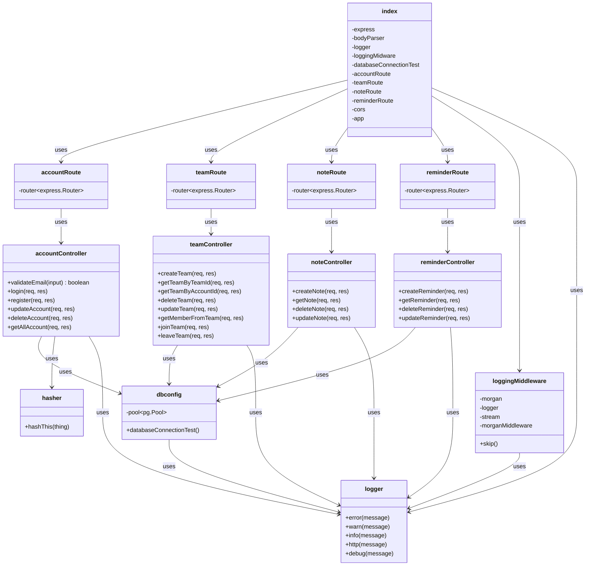
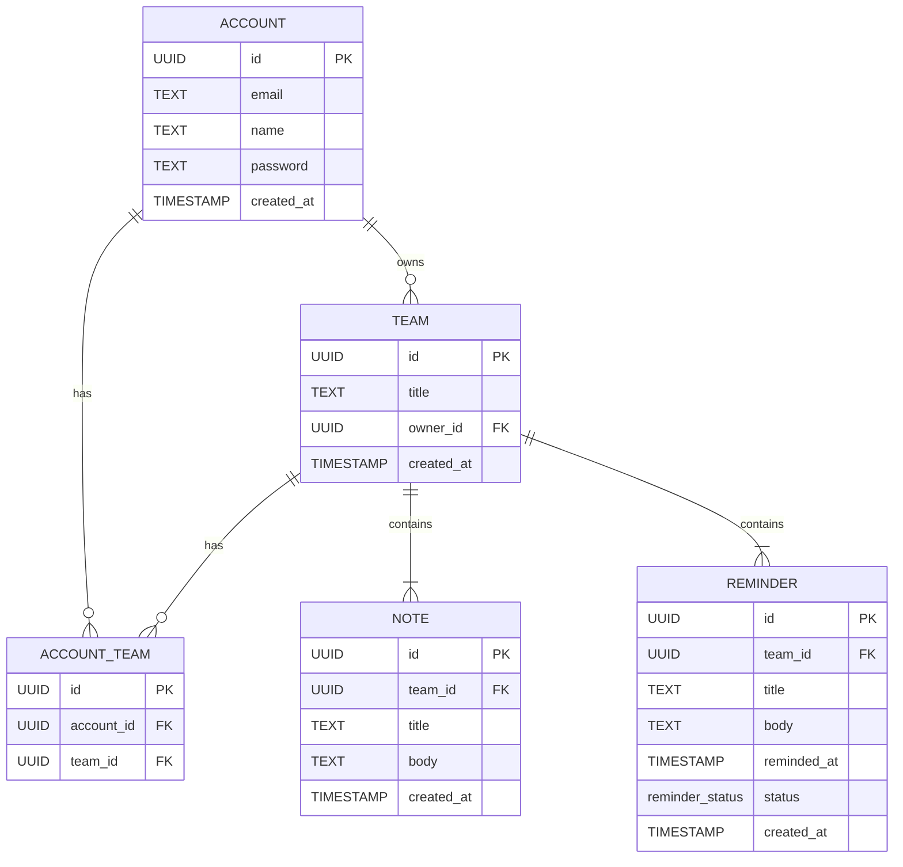

# SecondBrain (Backend)
Contains SecondBrain backend informations.

## UML Diagram


## ER Diagram


## Endpoints
### Base URL `/account`
> `POST /login`<br>
> Log into an existing account
>> Request body
>> ```json
>> {
>>    "email":"example@mail.com",
>>    "password":"example123"
>> }
>
>> Respond body (If success)
>> ```json
>> {
>>     "success": true,
>>     "message": "Login Success!",
>>     "data": {
>>         "id": "[UUID]",
>>         "email": "example@mail.com",
>>         "name": "Example Person",
>>         "password": "[64-bit hashed password]",
>>         "created_at": "[Timestamp with no timezone]"
>>     }
>> }

> `POST /register`<br>
> Register a new account
>> Request body
>> ```json
>> {
>>    "name":"Example Person",
>>    "email":"example@mail.com",
>>    "password":"example123"
>> }
>
>> Respond body (If success)
>> ```json
>> {
>>     "success": true,
>>     "message": "Register Success!",
>>     "data": null
>> }

> `DELETE /:accountId`<br>
> Delete an account
>> ```json
>> {
>>    "password":"example123"
>> }
>
>> Respond body (If success)
>> ```json
>> {
>>     "success": true,
>>     "message": "Delete success!",
>>     "data": null
>> }

> `PUT /:accountId`<br>
> Update an account
>> Request body
>> ```json
>> {
>>    "name":"[new name]",
>>    "email":"[new email]",
>>    "password":"[new password]"
>> }
>
>> Respond body (If success)
>> ```json
>> {
>>     "success": true,
>>     "message": "Update Success!",
>>     "data": {
>>         "id": "[UUID]",
>>         "email": "[new email]",
>>         "name": "[new name]",
>>         "password": "[new 64-bit hashed password]",
>>         "created_at": "[Timestamp with no timezone]"
>>     }
>> }
### Base URL `/team`
> `POST /create` Create a note

> `GET /:teamId` Get all notes from a team

> `DELETE /:noteId` Delete a note

> `PUT /:noteId` Update a note
### Base URL `/note`
> `POST /create` Create a note

> `GET /:teamId` Get all notes from a team

> `DELETE /:noteId` Delete a note

> `PUT /:noteId` Update a note
### Base URL `/reminder`